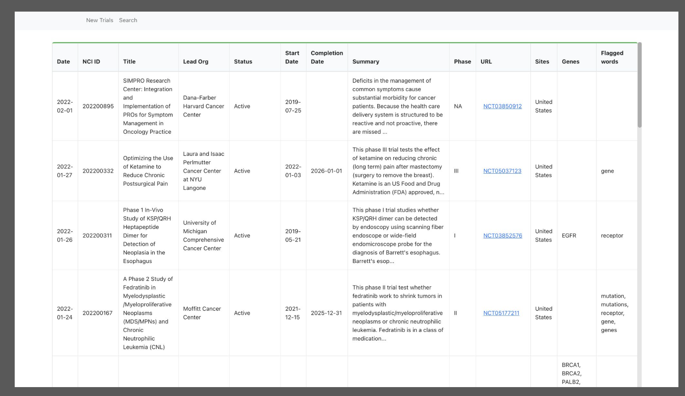

# Clinical Trials Tool
**Description** \
This tool allows users to intelligently search for clinical trial data. The search will gather clinical trials and extract notable genes, key words, and other important information. This allows users to quickly parse through large amounts of clinical trials for trials of interest. Further, a tab on the website keeps track of new trials, and updates the list with new ones daily.

**Technology** \
This application has a React frontend and a serverless backend utilizing AWS Lambdas and AWS API Gateway. Data is stored in a MongoDB cloud database.

